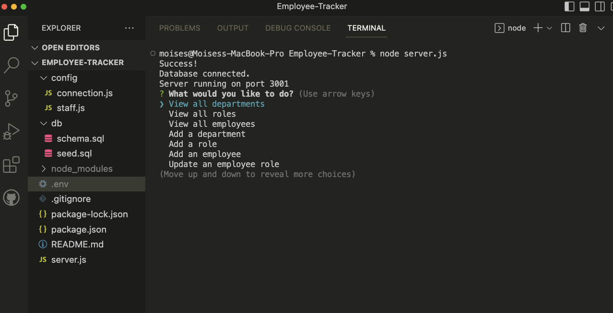
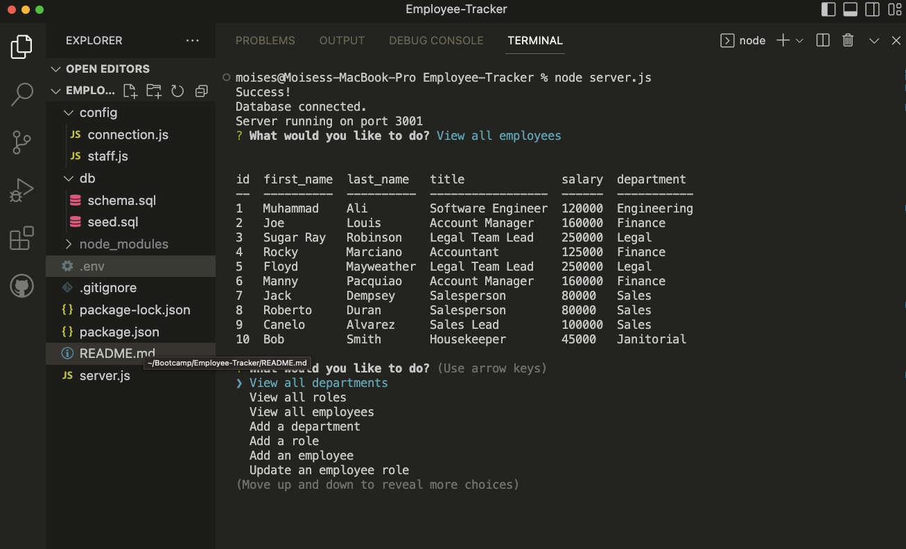

# Employee-Tracker

## Description

The employee tracker app is a command-line content management system to manage a company's employee database. The app allows the user to view all departments, all roles, all employees, and also to add a dept, role, or employee. It also allows the user to update an employee's role.
The technologies used in this command-line interface are mysql, express.js, inquirer package, as well as mysql2.

## Visuals

## Link to Video:
